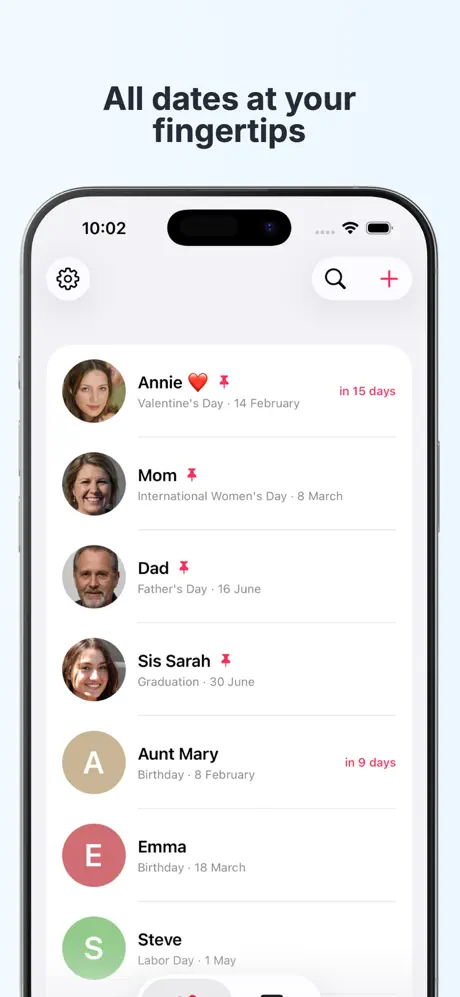
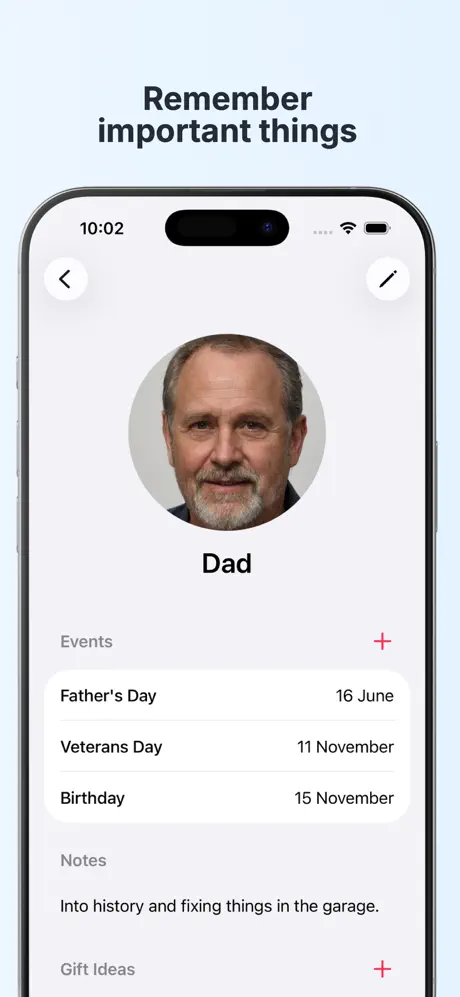
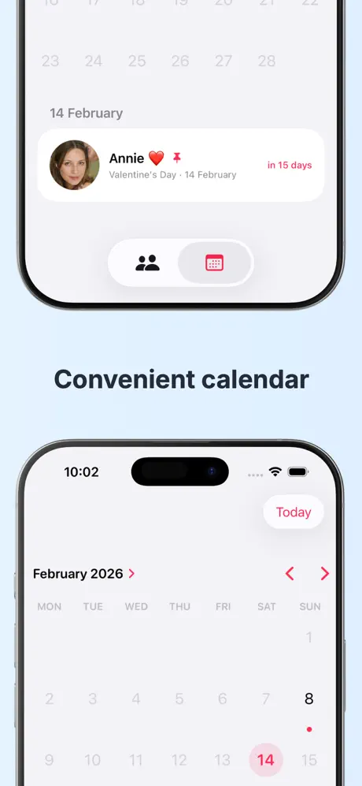
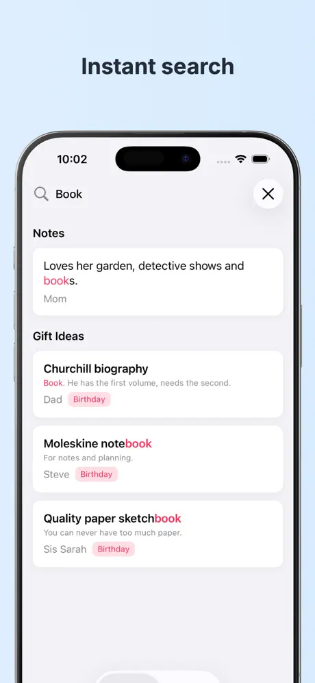
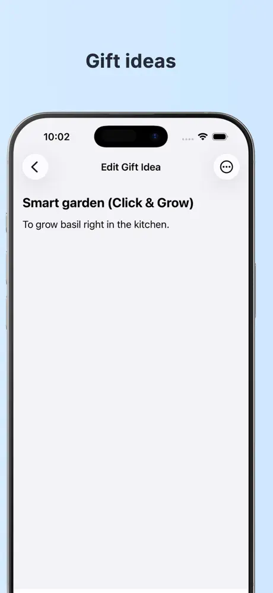

A simple iOS app for remembering birthdays, special dates, and gift ideas for the people you care about.

Dear Dates helps you remember important days for the people you care about — without complicated spreadsheets or cluttered apps.

## Why you’ll love Dear Dates

**Everything about your loved ones in one place**  
More than just a date in a calendar. Add photos, notes, favorite flowers, ring sizes, and anything else that helps you make your поздравление special.

**Smart sorting**  
Upcoming birthdays and events automatically move to the top, so you always know who’s next.

**Flexible reminders**  
Set reminders exactly how you like — a week before to find the perfect gift or on the morning of the event.

**Your personal Idea Bank**  
Heard someone say “That bag looks amazing”? Save gift ideas instantly so you’re ready when the day comes.

**The whole year at a glance**  
A clean calendar view shows all upcoming birthdays and events, making it easier to plan your time.

**Powerful search**  
Search by names or notes. Remember someone wanted “LEGO” but forgot who? Just type it in.

**Privacy first**  
No data collection. Everything stays on your device and can optionally sync via iCloud.

  
  
